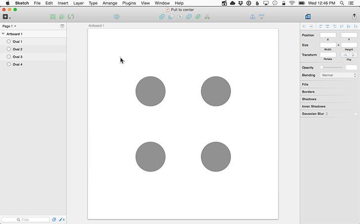

Sketch plugin: Pull to center
=================

Sketch plugin to move selected shapes or layers toward the center of artboard.

## Demo

## Installation

1. [Download the latest release](https://github.com/delighted/sketch-pull-to-center/releases/latest) and unzip it.
2. Double click "sketch-pull-to-center.sketchplugin"

## Usage

1. Select one or more shapes or layers.
2. Navigate to "Plugins > Pull to center".
3. Type the distance in pixels you'd like to move the shapes or layers and click "OK".

## Feedback

Send any comments, concerns, or suggestions to [mike@delighted.com](mailto:mike@delighted.com)

## Contributing

1. Fork it
2. Create your feature branch (`git checkout -b my-new-feature`).
3. Commit your changes (`git commit -am 'Add some feature'`).
4. Push to the branch (`git push origin my-new-feature`).
5. Create new Pull Request.
